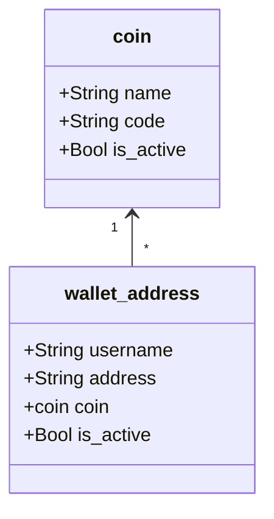

# ExpressJs Federated Crypto Payment Address Protocol

This is an implementation of the [Federated Crypto Payment Address API](https://github.com/backupbrain/federated-crypto-address-api) written in [Node.js/Express](https://expressjs.com/).

The purpose of this protocol is to retrieve a crypto wallet address from a human-friendly, domain-hosted address such as an email address.

With this API, a crypto wallet could look up an address, for example `BTC` wallet for `backupbrain@gmail.com`. The API server will respond with a crypto wallet address, for example `1jM9o3y7KL6DK2fvEwkCJmaNVvar85B3R`

As per the [specification](https://github.com/backupbrain/federated-crypto-address-api), this API server must run on port `8325`.

## Database Structure


Mermaid Class Diagram for this relationship:


## Setup

This software runs as a docker image, which hosts a REST API.

To use it, you must:
1) Download
2) Set Up
3) Deploy
4) Test

### 1 Download

To install, download this code on your server and install the dependencies

```bash
$ git clone https://github.com/backupbrain/expressjs-federated-crypto-address-api.git
$ cd expressjs-federated-crypto-address-api
$ npm init
```

### 2 Set Up

To set up, you'll need to copy the `.env.example` to `.env` and modify to suit your needs.

By default, the environment is set up like this:

```
API_KEY=26a350b2e541e3505ffac930d50b1c3a  # Administrative API key - change this!
```

**Set up Database**

Open a terminal window and type the following command:

```bash
$ npm run setup
```

This will create the database structure.


### 3 Deploy

You can serve this project from the terminal and connect it through [Nginx](https://nginx.org/), or [Apache](https://httpd.apache.org/)

```bash
$ npm run start  # run the server
```

Once it is running, try to create a new username/crypto address.

```bash
$ export $(grep -v '^#' .env | xargs)  # export API_KEY variable from .env file
$ curl -H "Authorization: Api-Key $API_KEY" -d '{"address": "1jM9o3y7KL6DK2fvEwkCJmaNVvar85B3R"}' http://your-host.com:8325/api/1.0/addresses/email@example.com/BTC/
```

### 4 Test

Once you have everything deployed properly and you have one or more addresses, you can test your API:

**Request**
```
GET /api/1.0/addresses/email@example.com/BTC/
```

**Response**
```
HTTP/1.1 200 OK
Content-Type: application/json;encoding=utf-8

{"address":"1jM9o3y7KL6DK2fvEwkCJmaNVvar85B3R"}
```

## Other functions

Though not in the original specification, this API allows for the creation, update, and deletion of addresses, when a valid API key is present.

### Create and Update Addresses:

**Request**

```
POST http://your-host.com:8325/api/1.0/addresses/youremail@example.com/BTC/
Content-Type: application/json;encoding=utf-8
Authorization: Api-Key 26a350b2e541e3505ffac930d50b1c3a

{"address":"1jM9o3y7KL6DK2fvEwkCJmaNVvar85B3R"}
```

**Response**
```
HTTP/1.1 201 Created
Content-Type: application/json;encoding=utf-8

{"status":"success"}
```

### Delete an Address


**Request**
```
DELETE http://your-host.com:8325/api/1.0/addresses/youremail@example.com/BTC/
Content-Type: application/json;encoding=utf-8
Authorization: Api-Key 26a350b2e541e3505ffac930d50b1c3a
```

**Response**

```
HTTP/1.1 200 OK
Content-Type: application/json;encoding=utf-8

{"status":"success"}
```

If you enjoy this tool, please feel free to support me

[](https://ko-fi.com/S6S53GD2U)
