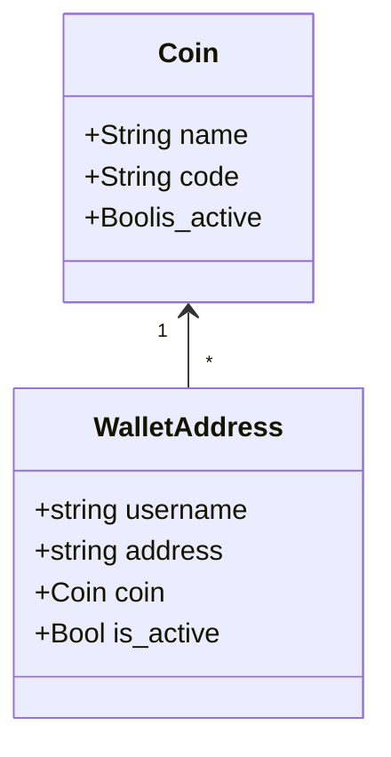

# Django Federated Crypto Payment Address Protocol

This is an implementation of the [Federated Crypto Payment Address API](https://github.com/backupbrain/federated-crypto-address-api) written in [Python3/Django](https://djangoproject.com/).

The purpose of this protocol is to retrieve a crypto wallet address from a human-friendly, domain-hosted address such as an email address.

With this API, a crypto wallet could look up an address, for example `BTC` wallet for `backupbrain@gmail.com`. The API server will respond with a crypto wallet address, for example `1jM9o3y7KL6DK2fvEwkCJmaNVvar85B3R`

As per the specification](), this API server must run on port `8325`.

## Database Structure


Mermaid Class Diagram for this relationship:


## Setup

This software runs as a docker image, which hosts a REST API.

To use it, you must:
1) Download
2) Set Up
3) Deploy
4) Test

### 1 Download

To install, download this code on your server and install the dependencies

```bash
$ git clone 
$ cd federated-pay
$ pip3 install -r requirements.txt
```

### 2 Set Up

To set up, you'll need to copy the `system/.env.example` to `system/.env` and modify to suit your needs.

**Set up Environment**

By default, the environment is set up like this:

```
DEBUG=on  # Enable debugging
SECRET_KEY=django-insecure-x-c1l4rq*x5pumi=e36s@2szvsyw-o+7$hs*m(+qxdvvgr_s#b
ALLOWED_HOSTS=*
DATABASE_URL=sqlite:////./db.sqlite3  # Use a local SQLite file
```

**Set up Database**

Open two terminal windows. In the first window, start the Django service.

```bash
$ python3 manage.py runserver 8325
```

In the second window, performm the database migrations on your database.

```bash
$ python3 manage.py makemigrations
$ python3 manage.py migrate
$ python3 manage.py collectstatic
```

**Create Superuser**

You will need to create a superuser to administer the API keys and to be able to manually add addresses.

```bash
$ python3 manage.py createsuperuser
```

### 3 Deploy

You can serve this project from [Nginx/Gunicorn](https://gunicorn.org/), [Apache](https://httpd.apache.org/) or from the Django server. 

Once it is running, you must log into the admin at `http://your-host.com:8325/admin/` and:
1) Create a new API key to allow for API-based modification of records
2) The creation of coin tickers and wallet addresses. *Note: Coin ticker symbols are case-sensitive.*

Try putting in your favorite coin or `BTC` as a `Coin`, and then create a `Wallet Address` with your email address and your favorite coin's address.

### 4 Test

Once you have everything deployed properly and you have one or more addresess, you can test your API:

```bash
$ curl http://your-host.com:8325/api/1.0/addresses/youremail@example.com/BTC/

{"address":"1jM9o3y7KL6DK2fvEwkCJmaNVvar85B3R"}
```

If you enjoy this tool, please feel free to support me

[](https://ko-fi.com/S6S53GD2U)
